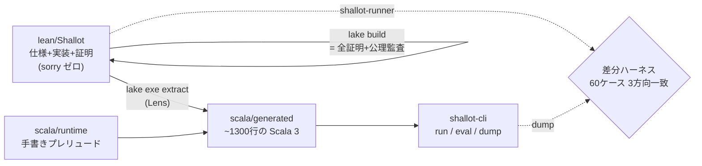

# Shallot + Lens

[English](README.md) | **日本語**

**完全な仕様・実装・機械検証された証明のセット、そして Lean 4 → Scala 3 抽出器。**

- **Shallot** — Lean 4 で仕様・実装・証明を書いた第一階関数型ミニ言語。
  形式意味論つき PEG パーサフレームワーク、健全かつ完全な型検査器、
  型健全なインタプリタ、意味保存の定数畳み込み最適化器、
  正しさ証明つきスタック VM コンパイラ、検証済み赤黒木マップ。
- **Lens** — Lean 4 → Scala 3 抽出器（Lean メタプログラム、等式補題ルート）。
  既知の先行事例なし。Shallot の実行可能部分を idiomatic な Scala 3 に抽出する。



## 何が証明されているか

30本超のフラッグシップ定理、すべて `sorry` ゼロ・標準公理
（`propext`/`Classical.choice`/`Quot.sound`、多くはそれ以下）のみ。
`lean/Audit.lean` の `#guard_msgs in #print axioms` により**ビルド自体が公理監査**。
完全な一覧は [docs/theorems.md](docs/theorems.md)。ハイライト：

- **PEG**: Ford 流形式意味論に対するインタプリタの健全性・完全性・決定性
  （決定性は構文木の一意性込み・公理ゼロ）
- **型検査器**: 型付け関係に対して健全**かつ**完全
- **型健全性**: well-typed なプログラムは stuck しない（`divByZero` のみ許容）
- **コンパイラ正しさ**: `runProgram` が値 v で成功 ⇒ コンパイル済み VM も同じ v
- **最適化器**: 定数畳み込みは型と評価結果を保存（プログラム全体レベル）
- **赤黒木**: BST 順序・赤黒平衡（Okasaki、フル強度）・モデル refinement
- **パーサ roundtrip**: 正準印字は検証済み PEG パーサで元の AST に復元される。
  締めの `pipeline_correct` が print → parse → 型検査 → 評価 → VM を全合成

具象構文のパーサは**検証済み汎用 PEG インタプリタに文法データを与えたもの**なので、
PEG の健全性・完全性・決定性が Shallot パーサにそのまま適用される。

余談の収穫：roundtrip 証明の過程で、差分テスト 60 ケースが一度も踏まなかった
**本物の文法境界条件**が見つかった（裸の変数を本体に持つ関数の直後に `(` 始まりの
main が続くと、PEG の優先選択 `Call / Ident` が関数境界を越えて関数呼び出しとして
貪ってしまう）。証明側が実パーサへの反例で実証した上で、明示的な分離ガード付きで
定理を証明した。「形式検証は仕様の穴を見つける」の実例や。

## 動かす

```sh
scripts/install-lean.sh   # elan + Lean v4.32.0（初回のみ、~1.5GB）
make verify               # 監査 → 全証明検査 → 抽出器golden → ドリフト → sbt test → 差分60ケース

cd scala
sbt "shallotCli/run run ../examples/fact.shl"      # => ok:3628800
sbt "shallotCli/run run ../examples/collatz.shl"   # => ok:111
sbt "shallotCli/run eval \"1 + 2 * 3\""            # => ok:7
```

CLI の言語処理は**全部 Lean からの抽出コード**や：パース＝形式検証済み PEG
インタプリタ、型検査＝健全性・完全性証明済み、評価＝型健全性証明済み。

## 規模

Lean 約 11,800 行（うち証明 約 8,000 行）、Lens 抽出器 約 4,000 行、
生成 Scala 約 1,300 行、差分コーパス 60 ケース、コミット 27。

## TCB（信頼ベース）

**信頼するもの**: Lean カーネル、Lens 抽出器、手書き Scala ランタイム
（`shallot.rt`、約 550 行）、Scala 3 コンパイラと JVM。
**検証済みのもの**: Lean レベルの全定理（上記）。
橋渡しは差分ハーネス（`corpus/`）：ケーステーブル自体を Lean で定義して抽出し、
Lean ネイティブ実行と抽出 Scala 実行を突き合わせる——レンダラや評価器の
ドリフトは即座に差分として現れる。抽出器の対応範囲と制約は
[docs/extractable-subset.md](docs/extractable-subset.md)。

## 方針

- `sorry`・`admit`・`native_decide`・追加公理はソースに存在しない
  （`scripts/audit-source.sh` がソースレベルで、`Audit.lean` が意味レベルで拒否）
- `scala/generated` はコミットされ、`scripts/check-drift.sh` が鮮度を機械保証
- 外部依存ゼロ（Mathlib / Batteries 不使用）、ツールチェーンは v4.32.0 に固定
