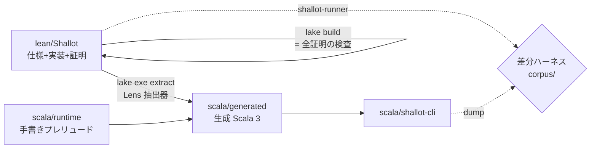

# Shallot + Lens

**Shallot** — 完全な仕様・実装・機械検証された証明を Lean 4 で書いた第一階関数型ミニ言語
（PEGパーサフレームワーク＋形式意味論、型検査器、インタプリタ、定数畳み込み最適化器、
スタックVMコンパイラ、赤黒木マップ）。

**Lens** — Lean 4 → Scala 3 抽出器（Leanメタプログラム）。Shallot の実行可能部分を
読みやすい Scala 3 に抽出する。



## TCB（信頼ベース）

**信頼するもの**: Lean カーネル、Lens 抽出器、手書き Scala ランタイムプレリュード、
Scala 3 コンパイラと JVM。
**検証済みのもの**: Lean レベルの全定理（定理一覧は完成時に本欄へ）。
差分コーパス（`corpus/`）が、信頼側の抽出経路に対する経験的チェックとなる。

## ビルド

```sh
scripts/install-lean.sh   # elan + Lean v4.32.0（初回のみ）
make verify               # 監査 → 全証明検査 → 抽出器テスト → ドリフト検査 → sbt test → 差分ハーネス
```

## 方針

- `sorry` ゼロ。未証明の定理はソースに存在しない（`docs/roadmap.md` の TODO にのみ存在する）
- 公理は `propext` / `Classical.choice` / `Quot.sound` のみ。`lean/Audit.lean` の
  `#guard_msgs in #print axioms` がビルド時に機械検証する
- `scala/generated` はコミットされ、`scripts/check-drift.sh` が鮮度を保証する
- 外部依存ゼロ（Mathlib / Batteries 不使用）
