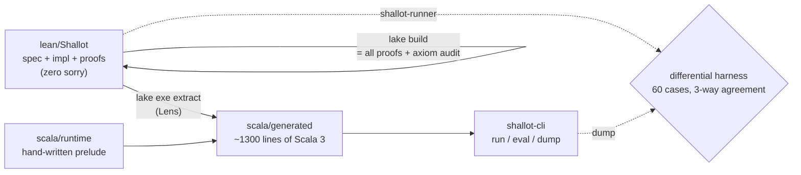

# Shallot + Lens

**English** | [日本語](README-ja.md)

**A complete specification, implementation, and machine-checked proofs — plus a
Lean 4 → Scala 3 extractor.**

- **Shallot** — a first-order functional language whose specification,
  implementation, and proofs all live in Lean 4: a PEG parser framework with
  formal semantics, a sound **and** complete typechecker, a type-sound
  interpreter, a semantics-preserving constant-folding optimizer, a stack-VM
  compiler with a full correctness proof, and a verified red-black tree map.
- **Lens** — a Lean 4 → Scala 3 extractor (a Lean metaprogram built on the
  equation-lemma route; no prior art known). It extracts Shallot's executable
  fragment into idiomatic Scala 3.



## What is proven

30+ flagship theorems, all with zero `sorry` and only the standard axioms
(`propext` / `Classical.choice` / `Quot.sound` — many need fewer). The
`#guard_msgs in #print axioms` blocks in `lean/Audit.lean` make **the build
itself the axiom audit**. Full inventory: [docs/theorems.md](docs/theorems.md)
(Japanese). Highlights:

- **PEG**: interpreter soundness, completeness, and determinism against a
  Ford-style formal semantics (determinism includes parse-tree uniqueness and
  uses no axioms at all)
- **Typechecker**: sound **and** complete w.r.t. the typing relation
- **Type soundness**: well-typed programs cannot get stuck (only `divByZero`
  is possible; every stuck-class error is provably absent)
- **Compiler correctness**: if `runProgram` succeeds with value *v*, the
  compiled stack-VM computes the same *v*
- **Optimizer**: constant folding preserves both typing and evaluation
  results, at the whole-program level
- **Red-black tree**: BST ordering, red-black balance (Okasaki, full
  strength), and model refinement down to association lists
- **Parser roundtrip**: canonically printed programs re-parse to exactly the
  original AST through the verified PEG parser, composed into the closing
  `pipeline_correct` theorem (print → parse → typecheck → evaluate → VM)

The concrete-syntax parser is literally **the verified generic PEG interpreter
applied to a grammar value**, so PEG soundness/completeness/determinism apply
to the Shallot parser for free.

A fun by-product: the roundtrip proof **found a real grammar boundary
condition** that 60 differential test cases had never hit (a bare-variable
function body followed by a `(`-headed main expression is swallowed across the
function boundary by PEG's prioritized `Call / Ident` choice). The prover
demonstrated the counterexample against the actual parser, then proved the
theorem under an explicit separation guard. Formal verification catching a
specification hole, as advertised.

## Running it

```sh
scripts/install-lean.sh   # elan + Lean v4.32.0 (first time only, ~1.5GB)
make verify               # audit -> all proofs -> extractor goldens -> drift
                          #   -> sbt test -> 60-case differential harness

cd scala
sbt "shallotCli/run run ../examples/fact.shl"      # => ok:3628800
sbt "shallotCli/run run ../examples/collatz.shl"   # => ok:111
sbt "shallotCli/run eval \"1 + 2 * 3\""            # => ok:7
```

Every language operation in the CLI runs through code **extracted from Lean**:
parsing is the formally verified PEG interpreter, typechecking is proven
sound and complete, evaluation is proven type-sound.


## Application: a verified JSON parser (RFC 8259)

Built on the framework: `lean/Json/`. The RFC 8259 ABNF transcribed
rule-for-rule into PEG data (T1-T3 inherited), a syntax-verbatim AST, a
canonical printer, and the roundtrip theorem `parse_print_json` (strings
need no assumption; numbers only digit-shape well-formedness).
**Perfect y_/n_ score on JSONTestSuite**, and the extracted Scala parser
produces identical verdicts on all 318 files.
Try `sbt "shallotCli/run json '{\"a\": [1, 2.5e3]}'"`.

## Scale

~11,800 lines of Lean (~8,000 of them proofs), ~4,000 lines of extractor,
~1,300 lines of generated Scala, a 60-case differential corpus.

## Trusted computing base

**Trusted**: the Lean kernel, the Lens extractor, the hand-written Scala
runtime (`shallot.rt`, ~550 lines), the Scala 3 compiler and the JVM.
**Verified**: every theorem above, at the Lean level.
The bridge is the differential harness (`corpus/`): the case table itself is
defined once in Lean and *extracted*, so the Lean-native run and the
extracted-Scala run share one definition — any drift in the renderer or
evaluators surfaces immediately as a diff. The extractor's supported subset
and its restrictions are documented in
[docs/extractable-subset.md](docs/extractable-subset.md) (Japanese).

## Policies

- No `sorry`, `admit`, `native_decide`, or extra axioms anywhere in the tree
  (`scripts/audit-source.sh` rejects them at the source level, `Audit.lean`
  at the semantic level)
- `scala/generated` is committed; `scripts/check-drift.sh` mechanically
  guarantees it matches a fresh extraction
- Zero external dependencies (no Mathlib / Batteries); toolchain pinned to
  Lean v4.32.0
